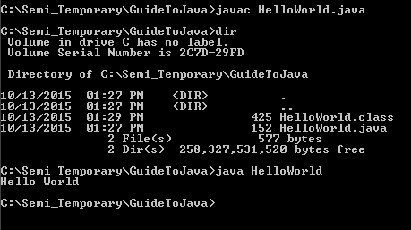

Now that we have Java setup we can write our first program. Just open up a text editor and we can get started. Any text editor should work however I recommend using a basic text editor which does not include auto complete. When you’re starting out I feel that’s it’s good practice to type out everything to ensure that you understand it. Syntax highlighting however is a nice feature that you may want to have for your text editor. My current go to text editor is Atom , however other good basic text editors include Notepad2, Notepad++, and Sublime Text.

Once you've chosen your editor open it up and type the following code.

~~~java
1.  //My first Java program
2.  
3.  public class HelloWorld{
4.    public static void main(String[] args){
5.      System.out.println();
6.    }
7.  }
~~~

There’s a lot of information here and we’ll be breaking it down soon but first let’s get it to run. Save the file as “HelloWorld.java” and navigate to that location in command prompt.
The process of programming can be broken down into 3 steps.

1.	Code
2.	Compile
3.	Run

We’ve just written the code however it’s written in Java and although we may not be able to understand it yet it uses English words so that we’ll have an easier time reading it. This does not make sense to the computer. The purpose of compiling is to take the code and convert it to something the computer can understand. Then once it’s compiled we can run the program.

>**Note:** The Java compiler is different from the compilers in other languages in that it doesn’t actually compile the code down to machine code. Instead it compiles it down to something called byte codes. The final compilation actually isn’t performed until the program is ran, where the Java Virtual Machine (JVM) takes the bytes codes and converts it to machine code. This is why Java and other languages like it are said to use Just-In-Time (JIT) compilers. The benefit is that you can compile it to bytecodes and then any platform with a JVM installed will be able to run your program. The drawback is that it hurts performance when the program is ran. We can compile the program by inputting `javac HelloWorld.java` then if you run `dir` you’ll notice that a new file called “HelloWorld.class” is created. This is the file which stores all the byte codes. Finally you can execute `java HelloWorld` to see what our program does.

 

If you got errors at the compilation step don’t panic. Just look back at the code and make sure you typed everything exactly as I did. Keep in mind that every character is important (including semi-colons) and that Java is case sensitive.
