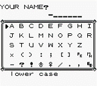

##3.1.1 Use of Variables
Variables are names that we can assign to values (these values can be numbers but they could be other things as well). The main benefit to using variables is that if we need to make changes we can adjust that variable rather than change the value whenever it's used.

For example if you were to write a story the same name would come up a lot

> *Catherine* is the main character in this sample story. She is a very brave character and *Catherine* is her name. She has two dogs and she name them both *Catherine* because it's easier that way.

If the name needed to be changed you can imagine that it would be very tedious to adjust all the places where the name is used. This is why we would create a variable called name, assign a value to the variable, and then reference the variable every time we need the name.

>name = Catherine

> *name* is the main character in this sample story. She is a very brave character and *name* is her name. She has two dogs and she name them both *name* because it's easier that way.

This specific application of variables is used in a lot of video games.

Aside from that there are tons of practical situations when you'd want to use variables in code. Websites have variables to represent your user name, your phone has a variable representing what it's battery life is and if you ever change a setting in any program there's a variable behind the scenes that's being updated. 

##3.1.2 Basic Syntax

3 Variables
	3.2 Data Storage
		Overview
		3.2.1 Storing Numbers
		3.2.2 Quick Binary Lesson
		3.2.3 Storage with Binary
	3.3 Data Types
		Overview (link to difference later on)
		3.3.1	Whole Numbers
		3.3.2	Decimal
		3.3.3	Special Types
		3.3.4	Strings
	3.4 Example Program
		3.4.1 	Wring the Program
		3.4.2	Quotations
		3.4.3 	Number modifiers
		3.4.4	String Concatenation
