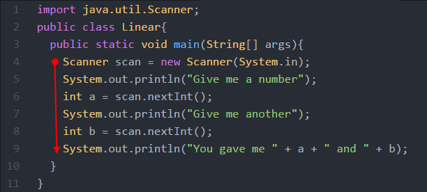
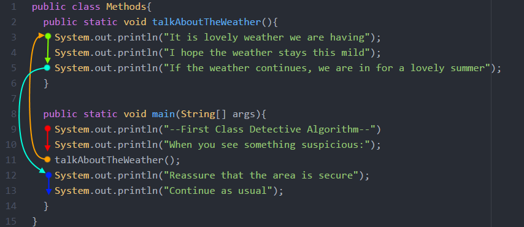

Now we'll start talking about how to create our mehtods

## 6.1.1 Calling vs. Defining

The first concept I'd like to clarify is the difference between **Calling** and **Defining**.

Calling is when you use a method. For example we often call `System.out.println()` but that doesn't mean we understand how it's implemented. When we call it the corresponding code for the method is can and then the program continues where it left off. The place where the code for the method is actually written is the place where the method is defined. Here's an example program:

```java
public class Greet{
  public static void main(String[] args){
    greet();//calling
  }

  //defining
  public static void greet(){
    System.out.println("Hello");
  }
}
```

Here `greet()` is called in the main method but it's defined later. We see that the method definition contains a print statement which prints "Hello", so that's what it does when `greet()` is called. If you run this code it should just print "Hello".

We'll be dedicating the majority of this chapter toward understanding how to define methods and also the various things you make the methods do.

## 6.1.2 Code Flow

One of the confusing concepts related to using methods is that the code flow changes. Up until now our programs have flowed linearly, meaning that when one line of code is completed it always just goes down to the next line. Here's an example:



When it comes to calling methods the program jumps towards where the method is defined and then comes back.



Here the first to 2 print statments in main are executed. Then `talkAboutTheWeather()` is called and the program jumps to where the method is defined, it then goes back to where the method is called and completes the code in the main method.

It's also worth noting that it doesn't matter where in the class the methods are defined. In the previous example we defined the new method above the main method however in the `CallVsDefine` example we defined the new method below the main method. Regardless of which method is defined first, Java will always start the program by calling the main method.

## 6.1.3 Components of Methods

I like to think of the purpose of methods as being broken down into 3 tasks

* Take Stuff
* Do Stuff
* Give Stuff

Here are some examples of built in Java methods and how they can be broken down

* `Math.pow(x,y)` **Takes** x and y, **Does** math, **Gives** x to the power of y
* `Math.sin(x)` **Takes** x, **Does** math, **Gives** sin of x
* `System.out.println(word)` **Takes** word, **Does** printing, **Gives** nothing

Each of the following sections will address 1 of these tasks (although I'll be using slightly more academic sounding terms for the titles).
