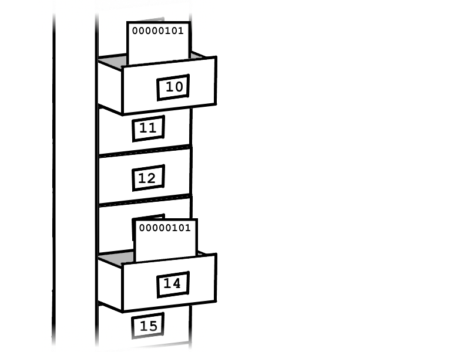
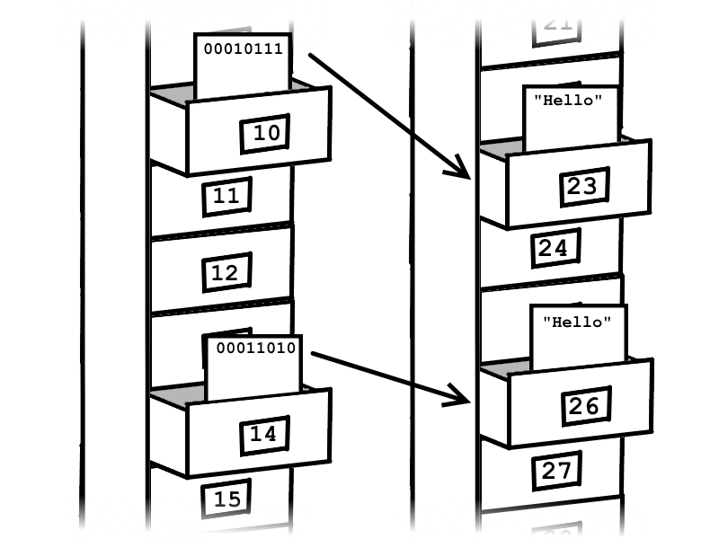
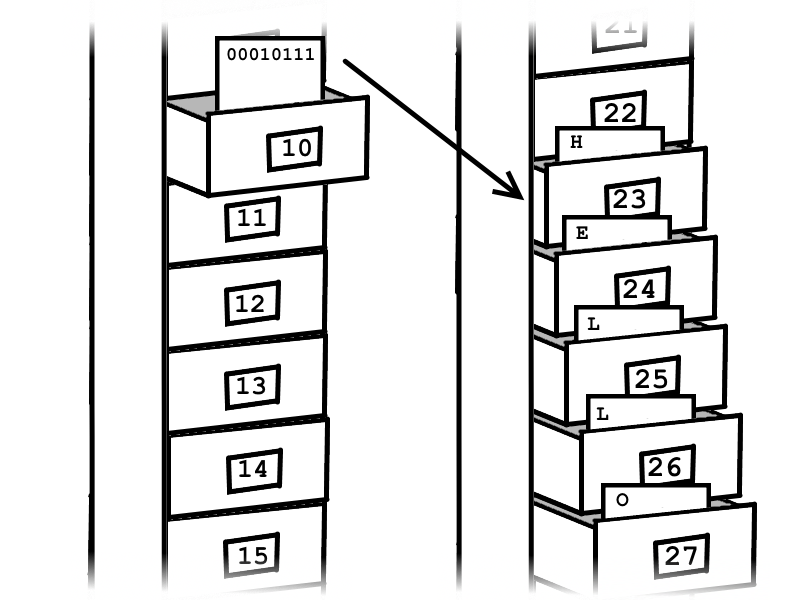

## 8.1.1 Outline

This section features a project, but before we get started with that we need to go over a few things, the first item is the differences between primitive and reference types. The main reason we need to go over this is because we'll be comparing strings in this project and unlike primitives, which can simply be compared using `a == b`, strings have to use a more complicated syntax `a.equals(b)`. This has to do with how Java handles reference types (such as strings) differently from primitive types. This could have been covered in the data types section but the answer is fairly involved and I wanted to keep that part simple. This is something that you should probaly know eventually though, so now's as good a time as any.

## 8.1.2 Comparing Primitives

Let's go into some details about what the computer does when it sees `a == b`. As stated in chapter 3, memory on your computer is split into bytes, you can think of the memory as a big dressor with millions of drawers and each drawer holds a single byte. If our variables are `byte a` and `byte b`, then both variables would be associated with their own drawer in memory.



So in this image `a` is associated with drawer 10 and `b` is associated with drawer 14. For this example we'll say that both a and b are equal to `5`. If that's converted to binary that's equal to `00000101`, so in this scenario both drawers have the value `00000101`. When the computer runs `a == b`, it opens the drawer associated with `a` and the drawer associated with `b` and compares the values within the drawers. Since both values are the same it will return true in this case.

## 8.1.3 Comparing Reference types



The key difference with reference types is that it stores an address in the drawer instead of a value. If we had variables `String str1 = "Hello"` and `String str2 = "Hello"` the actual value in the drawer refered to by `str1` might be something like `00010111` (which is 23 in decimal), and `str2` might be `00011010` (which is 26 in decimal). These numbers have nothing to do with the value `Hello`, it only says where that value is located. So if you the computer tried to execute `str1 == str2`, it would open of the drawers and compare `00010111` and `00011010` and then subsequently return false. Using `str1.equals(str2)` work better because `equals()` knows how the data is structured so it can actually compare the information more intelligently.

## 8.1.4 So why Reference types?

This leads us to the question of why would you use reference types? `str1` is already pointing to a drawer, why does that drawer need to point to another drawer? Can't the information just be stored in the first drawer? Since `Hello` requires more than a single byte of storage the information is actually spread out over multiple drawers. This is also the case with larger primitive types such as `int` or `long` but that doesn't cause a problem since they always take up the same number of drawers (4 for `int`, 8 for `long`), so when the variable is first created the memory can just assign a that number of drawers to that variable.



Strings (and reference types in general) are different since the number of bytes required to store them can vary by a lot. Additionaly their sizes can change after they're initially created. For example

```
String str = "Hello";
str = "Hello World";
```

Here it will initially assign enough drawers to store `Hello` but then it needs more drawers when the variable is changed to `Hello World`. Because of the way memory works, changing the size of the variable actually means that a whole new set of drawers need to be selected for the variable. If this worked like a primitive type then `str` need to point to a different drawer, but since it's a reference type only the value within the drawn held by `str` needs to change.

>**Note:** The diagrams may be a little confusing in regard to how much space a String such as "Hello" actually requires. In 8.1.3, it takes one drawer which is clearly not the case since "Hello" is larger than a byte, however 8.1.4 also isn't quite right since "Hello" is 5 characters and in Java characters are 2 bytes so that would mean that would indicate that "Hello" is at least 10 bytes. In a laugauge like C where characters are only a signle byte (it can do this becuase it includes fewer possible options, Java chose 2 bytes so that it would be compatible with more languages), "Hello" could in theory be 5 characters. Both of these are still probably too low, since String variables also need to have a system for indicating how long the string is (when the computer reads the last character it doesn't necessarily know it's the last one), so that would add more memory as well. Luckily for us all these details are irrelevant for our purposes. Just know that there's some details that I've hidden and that's ok.
