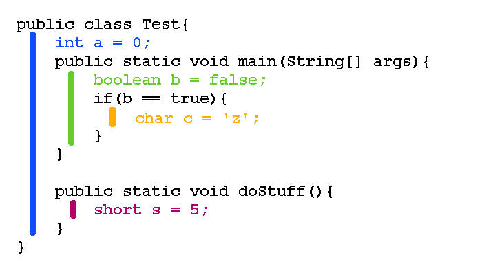

## 8.2.1 Description

The last item we need to discuss before the project is variable scope. When variables are made, they can't be used universally by any section of the program. The are a couple ways in which this is restricted but one of them is the scope. When a variable is made within a method, class or if statement, that means it can only be used within that area. Up till writing the majority of our code within the main method, and since we create our variables first that means that they can be accessed or adjusted from anywhere within the main method. We haven't tried to access variables created within the main method from other methods but if we did our program would crash because that violates the scope ruling. If we wanted make variables accessible to other methods we'd have to make them class variables, and you'll see how to do that in the next section.

## 8.2.2 Example

Here's a example program which clarifies how this works. Each variable is created in a different area, and the bars associated with that variable indicate the region where that variable can be used.



`a` is called a `class variable` since it's create within the class and outside any method. This means that it's accessible from anywhere within the class, so we can freely use that variable within the the `main` method or the `doStuff` method.

>**Note:** Technically `a` is called a `instance variable` since the variable is non-static, but scope ruling applies the same way regardless.

`b` is created in the `main` method so `b` can only be used within that method. If you tried to use `b` within `doStuff` the program would crash.

`c` is created within an if statement so it's only accessible from that if statement, if it's used anywhere else in the program it will crash since the variable can only be used within the if statement that it was created.

`s` is created within the `doStuff` method so it can only be used there. If it was refernced from the `main` method or anywhere else in the program it would also violate the scope ruling.

## 8.2.3 Duplicate variable names

Using scope you can create multiple variable that have the same name. Here's an example of how that might be done.

```java
public class DuplicatesWithScope{
    int a = 3;
    public static void main(String[] args){
        int b = 6;
        if( b < 8 ){
          int a = 5;
          System.out.println(a);
        }
        System.out.println(a);
        System.out.println(b);
        printSomething();
    }

    public static void printSomething(){
        int b = 4;
        System.out.println(b);
    }
}
```

When running this program it should println

```
5
3
6
4
```

Both of these variables are able to have duplicate names due to different scoping rules. The two `b` variables are allowed to be named the same because their scopes don't overlap. At any point in this program there's only one `b` variable within the scope so when refering to `b` it's clear which one you're refering to.

`a` is a little more complicated. At the first print statement there are actually two varibles named `a` within the scope. When conflicts like this happen, the program assumes that you're refering to the variable with the smaller scope. In this case the one created within the main method has a smaller scope so it's prints the value corresponding to that variable.

When 2 variables exist in this way the conflict can only be resolved when the scope are different, otherwise the program wouldn't know which one you're refering to. For this reason you're not allowed to create multiple varibles with the same name with the same scope. If you tried this Java would tell you the variable is already defined.   

## 8.2.4 Why have the scope ruling

This probably looks like it's needlessly confusing, "Why not just have variable be accessed anywhere?". There several reasons why this limitation helps software development overal.

1. Memory Optimization: If the computer knows that variables are only used within a limited scope then it can repurpose the memory for those variables toward other places when the program is outside of that scope. For example looking at the code in 8.2.2, there's no point in continuing to store `c` once the if statement is completed.

2. Duplicate variable names: Within projects it can be useful to have duplicate variable names. A common example is in games or graphical projects in general, each component has their own x and y variable, when working within those components it's intuitive to simply call the variables x and y. There wasn't scope they'd have to be unique, the names would have too look more like, windowX, dropdownBoxX, textFieldX, etc.

3. Large Project Efficieny: If there's no scope ruling then that means there can't be duplicate variables and if you're working in a large project it can be very frustrating to ensure that each variable needs to be unique. This would mean that everytime you made a new variable you'd have to be aware of all other variables that have been initialized within the project and with large projects individual programers almost never have that much knowledge and it would be far too much effort to ensure that everyone was aware of everything that was happening in the project.
