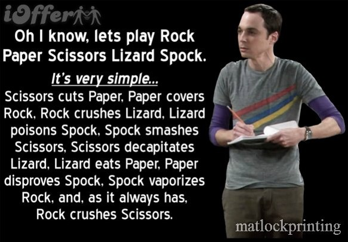
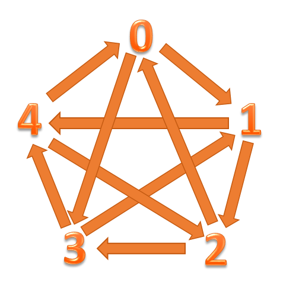

## 8.6.1 Description

Here's a more complicated version of the problem that you can use to test your knowledge. Instead of just Rock, Paper, Scissors, it also involves Lizard and Spock. For the exact rules you can refer to the [big bang theory episode](https://www.youtube.com/watch?v=Kov2G0GouBw).

The user interaction is the same as the previous one.

1. The computer requests a move from the user
2. User inputs Rock, Paper, Scissors, Lizard, or Spock
3. The computer will randomly select its move (again either rock, paper, scissors, lizard, or spock)
4. Finally the computer will compare the 2 answers and it will print either "you win", "I win", or "tie"

Good luck :)

## 8.6.2 Example usage

~~~
» java RockPaperScissorsLizardSpock
Please type Rock, Paper, Scissors, Lizard, or Spock:
Rock
Computer chose Paper
Computer Wins
~~~

~~~
» java RockPaperScissorsLizardSpock
Please type Rock, Paper, Scissors, Lizard, or Spock:
Scissors
Computer chose Scissors
It's a tie
~~~

~~~
» java RockPaperScissorsLizardSpock
Please type Rock, Paper, Scissors, Lizard, or Spock:
Lizard
Computer chose Lizard
It's a tie
~~~

~~~
» java RockPaperScissorsLizardSpock                                                             
Please type Rock, Paper, Scissors, Lizard, or Spock:
Spock
Computer chose Lizard
Computer Wins
~~~

~~~
» java RockPaperScissorsLizardSpock                                                              
Please type Rock, Paper, Scissors, Lizard, or Spock:
Paper
Computer chose Lizard
Computer Wins
~~~

~~~
» java RockPaperScissorsLizardSpock                                                               
Please type Rock, Paper, Scissors, Lizard, or Spock:
Rock
Computer chose Lizard
User Wins
~~~

## 8.6.3 Hint

You can use many of the same hints as mentioned in 8.4.

I recommend you use the following number for the options, since it will align with the diagram and it will make some of the logic simpler.

0. Rock
1. Paper
2. Scissors
3. Spock
4. Lizard

